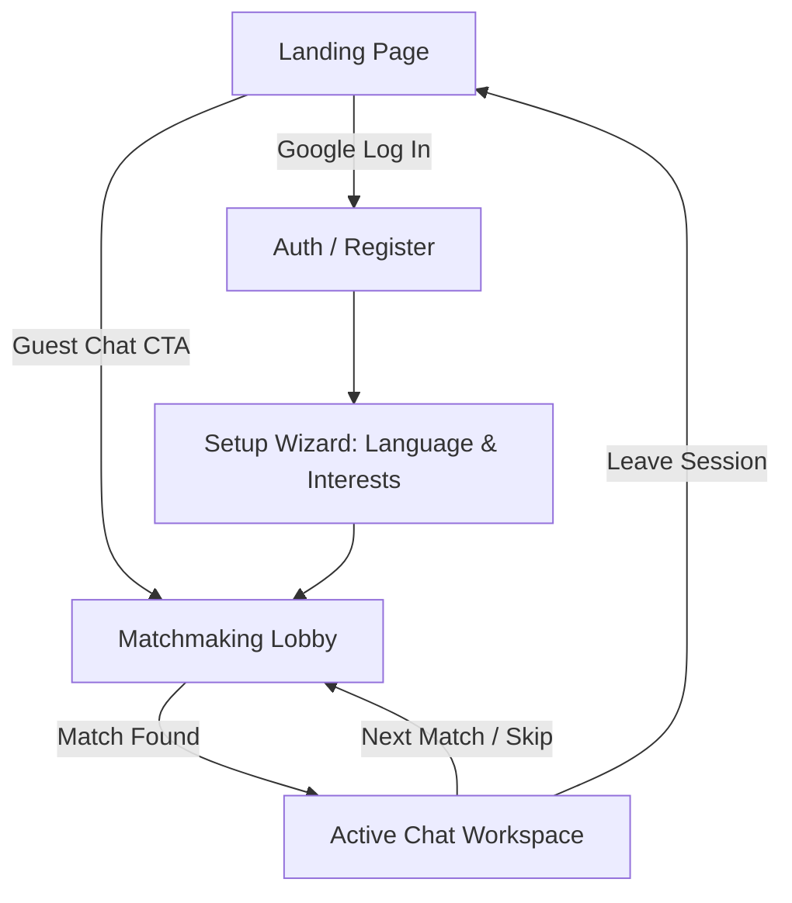

# LingoGen 💬 — UI/UX Design Roadmap & Style Guide

Welcome to the **LingoGen** design roadmap. This document serves as the guide for the UI/UX team to transform LingoGen from a clinical, high-contrast prototype into a premium, engaging, and approachable anonymous language exchange platform.

LingoGen blends the interest-based matchmaking of **Omegle** with the structured language-learning communities of **HelloTalk** and **Speak Pal**.

---

## 🎯 Design Vision & Brand Identity

Anonymous chatting platforms can be intimidating. Our primary goal is to **reduce user anxiety** and **remove entry friction**, turning the matching process into a delightful, rewarding experience.

### 🎨 Visual Theme: "Warm Cyber-Space"
We want to move away from cold, high-contrast, pure black/white interfaces. Instead, we use a sleek, modern dark mode with rich HSL colors, warm glowing backdrops, and glassmorphism.

*   **Personality:** Friendly, modern, safe, clean, and interactive.
*   **Aesthetics:** Soft corners, neon gradients, semi-transparent panels, and lively micro-animations.
*   **Typography:** Accessible, warm, sans-serif typefaces (e.g., [Plus Jakarta Sans](https://fonts.google.com/specimen/Plus+Jakarta+Sans), [Outfit](https://fonts.google.com/specimen/Outfit), or [Inter](https://fonts.google.com/specimen/Inter)).

---

## 🎨 Color Palette & Design Tokens

Use these color guidelines to maintain harmonious contrast across all components.

```
┌────────────────────────────────────────────────────────┐
│  Primary (Accent)   │  #8B5CF6 to #EC4899 (Neon Grad)  │
├─────────────────────┼──────────────────────────────────┤
│  Background (Dark)  │  #0F0F1A (Deep Midnight Blue)    │
├─────────────────────┼──────────────────────────────────┤
│  Surface (Card)     │  #1E1E30 (Semi-transparent 80%)  │
├─────────────────────┼──────────────────────────────────┤
│  Text Primary       │  #F3F4F6 (Off-white)             │
├─────────────────────┼──────────────────────────────────┤
│  Text Secondary     │  #9CA3AF (Muted Gray)            │
└────────────────────────────────────────────────────────┘
```

*   **Gradients:** Core Calls to Action (CTAs) should use gradients:
    `linear-gradient(135deg, #8B5CF6 0%, #EC4899 100%)`
*   **Borders:** Soft, rounded corners on cards and input fields:
    `border-radius: 12px` to `16px` (never hard `0px`).
*   **Backdrops:** Soft backlighting using glowing ambient blurs behind central panels to create depth.

---

## 🧭 Screen-by-Screen Design Roadmap



### 1. Landing & Authentication Screen
*   **UX Objective:** Give users instant gratification. Provide an immediate path to the core loop.
*   **Key Components:**
    *   **"Guest Mode / Instant Match" (Primary CTA):** A large, glowing gradient button that registers a temporary guest account (e.g., `Stranger#1245`) and queues the user instantly.
    *   **"Sign In with Google" (Secondary CTA):** A prominent, clean, brand-compliant Google authentication button.
    *   **Feature Pitch Cards:** A 3-column benefit section explaining Anonymous Match, Interest Filters, and Language Exchange.

### 2. Onboarding Setup Wizard (Profile Customization)
*   **UX Objective:** Fast profile setup. Minimize cognitive overload.
*   **Key Components:**
    *   **Step 1: Identity & Languages:** Selection of Native Language and Learning Language. Use clean dropdowns or clickable badge icons.
    *   **Step 2: Looking For:** Selection of intent (e.g., "Friendship", "Language Practice", "Casual Chat").
    *   **Step 3: Interest Badges:** Selection grid with 30 interest categories (grouped logically: Tech, Music, Sports, etc.). Selected items should toggle states with smooth color transitions.
    *   **Visual Indicators:** A step progress bar showing completion (e.g., Step 1/3) with a glowing status.

### 3. Matchmaking Screen (The "Lobby")
*   **UX Objective:** Reassure the user that the engine is actively pairing them. Build anticipation.
*   **Key Components:**
    *   **Match Spinner:** A central, spinning neon-purple radar/spinner animation.
    *   **Real-time Statistics:** A counter showing "Users Online" and "In Queue" to provide a sense of active community.
    *   **Tips/Icebreaker Carousel:** A small card below the spinner rotating interesting facts, conversation prompts, or language learning tips.
    *   **"Cancel Search" CTA:** A clean, accessible button to leave the matchmaking queue.

### 4. Active Chat Workspace
*   **UX Objective:** Foster connection, highlight commonalities, and make messaging seamless.
*   **Key Components:**
    *   **Smart Chat Header:**
        *   Displays the partner's status ("Stranger" or chosen guest handle).
        *   Shows **Shared Interests** as highlighted tags.
        *   Displays the **Language Match Info** (e.g., "🗣️ Native: Spanish | 📚 Learning: English").
    *   **Conversation Workspace:**
        *   Message Bubbles: Left-aligned for the partner (muted grey/dark background), right-aligned for the user (gradient or primary violet background) with clean rounded corners.
        *   Live typing indicators (smooth, bouncing dot animations).
    *   **Interactive Overlays:**
        *   **Ice Breaker Launcher:** A small button to insert one of 12 randomly generated questions (e.g., "What is a dish from your country I must try?") into the chat box.
        *   **Reaction Panel:** Hovering/long-pressing a message reveals a panel with emoji reactions (❤️, 😂, 👍, 👍, etc.) that float up when applied.
    *   **Dopamine/Retention Loop (The "Skip/Next" flow):**
        *   A prominent **"Next Match"** button displayed in the chat interface.
        *   When a partner disconnects, a full-overlay banner soft-fades into view: *"Stranger has left the chat. Match with another partner?"* with a primary, glowing **"Find Next Match"** button to re-queue with 1-click.

---

## ✨ Micro-Animations & Interactions Checklist

To elevate the platform to a premium standard, design layouts around these specific micro-interactions:

*   `[ ]` **Button Hover Effects:** Scale buttons up slightly (`scale(1.02)`) and expand their background box-shadow glow.
*   `[ ]` **Badge Selection:** Badges should "pop" into active status using a brief CSS keyframe animation.
*   `[ ]` **Message Delivery:** Newly sent/received messages should slide up smoothly from the bottom of the scroll container.
*   `[ ]` **Typing Indicator:** Use soft, bouncing dots that fade in/out during active typing events.
*   `[ ]` **Match Transition:** Transitioning from the Matchmaker to the Chat workspace should wipe screens using a fading curtain or sliding transition rather than an abrupt page reload.
*   `[ ]` **Active Session Glow:** Provide a slow pulsing border/ambient glow around the matchmaking lobby card to simulate live scanning.

---

## 🛠️ Design Handoff Deliverables

For development alignment, please provide:
1.  **Figma/Design Files:** Responsive layouts for Desktop (1440px) and Mobile (375px).
2.  **Typography tokens:** H1, H2, Body, and Caption sizing/weight guidelines.
3.  **Color tokens:** SVG gradient specs and HSL/Hex variables.
4.  **Icon Assets:** SVG format icons for interest categories (e.g., 🍕 Food, 🎮 Gaming, 🎸 Music) and chat action items.
